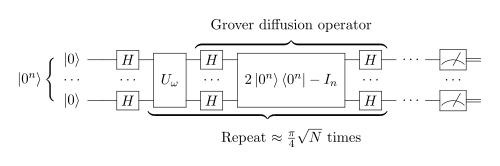

It's been some time now since we started hearing about how quantum computers will change the world of cryptography. While there is still no quantum computer capable of breaking currently most-used public-key cryptography algorithms, which is also called a *cryptographically relevant quantum computer*, it's important to start thinking about what will happen when that day comes. This is what we call *Post-Quantum Cryptography* (PQC). As developers, we need to be prepared for that day. In this post, I will give you a brief introduction to PQC (from the viewpoint of a non-specialist, just very curious developer) and point to what are the current developments in the area. 

# What is a quantum computer?
First of all, let's talk about what is a quantum computer. In *classical computers*, data is stored in bits, which can be either 0 or 1, and we operate the data by performing logical operations (and, or, xor, etc.) on these bits until we get the desired result. *Quantum computers*, on the other hand, use quantum bits, or *qubits*, which can be in a superposition of states, which means they can be 0 and 1 at the same time. You may be thinking "how is that possible?". Well, that's quantum mechanics for you. 

Have you ever heard about Hiseinberg's Uncertainty Principle? That's one of the principles that makes quantum mechanics so weird. This principle states that we can't know the exact position and momentum of a particle at the same time. This is because the act of measuring the position of a particle changes its momentum and vice versa. So the particle is in a superposition of states *until we measure it*. This also relates to the "Schrodinger's cat" thought experiment.

    A cat is in a superposition of states of being alive and dead until we open the box and measure it. <a href="https://en.wikipedia.org/wiki/Schr%C3%B6dinger%27s_cat" target="blank_">Source</a>

This is what happens with qubits. We don't know if the outcome of a qubit is 0 or 1 until we measure it, when it is said to *collapse* to one of the states. All we know before measuring is the *probability* of the outcome being 0 or 1. So we may have a qubit that is 70% likely to be 0 and 30% likely to be 1. When we measure it, it will collapse to one of the states, but we don't know which one before measuring.

We can manipulate the probability of the outcome by applying *quantum gates* to the qubits. These gates are the quantum equivalent of classical logical gates. Hence, in a way, we can say that a quantum computer programs are probabilistic experiments. We want to compose sequences of quantum gates that will make the qubits collapse to the desired state, with high probability, when we measure them.

But that's not all. Here comes another principle of quantum mechanics: *quantum entanglement*. When two particles are entangled, the state of one particle is directly related to the state of the other particle, *no matter how far apart they are*. Crazy, right? Einstein even called this "spooky action at a distance". We can also entangle qubits in a quantum computer, meaning that we can manipulate one qubit and affect other qubits that are entangled with it.

The state of entangled qubits is described by a *quantum state vector*, which is a vector in a complex vector space. While the state of a single qubit is given by the probabilities of it collapsing to 0 or to 1, the state of two entangle qubits is given by the probabilities of it collapsing to 00, 01, 10 or 11 (all the posibilities for the 2 qubits). This means that a quantum computer with 100 qubits can represent $2^{100}$ states at the same time and manipulate all these states!! In a classical computer, this is impossible, because each state has to be represented by it's probabilities in a classical computer, taking both too much space and too much time to emulate. That's what makes quantum computers so powerful.

# Breaking cryptography on quantum computers - Shor's and Grover's algorithms
With these properties, quantum computers can be used to solve some real hard classical problems. Two notable algorithms that show the power of quantum computers are *Shor's algorithm* and *Grover's algorithm*, which are known to break the basis for some modern cryptographic techniques.

Shor's algorithm is a technique based on a quantum circuit that allows one to find a hidden subgroup inside of a larger group. As a consequence, it can solve both the factorization of large numbers and the discrete logarithm, which are problems considered hard to solve in a classical computer. 

The hardness of the factorization of large numbers is the base for the security of RSA, the most used public key cryptography algorithm today. Also, the discrete logarithm is the base for the security of both the Diffie-Hellman, a key establishment technique used, for example, in TLS, and the Elliptic Curve Cryptography (ECC), used in Bitcoin's signatures. So yes, an adversary with access to Shor's algorithm could break a lot of cryptographic protocols used today.

    Quantum circuit in Shor's algorithm. <a href="https://en.wikipedia.org/wiki/Shor%27s_algorithm" target="blank_">Source</a>

Grover's algorithm is a quantum algorithm that can search an unsorted database in $O(\sqrt{n})$ time, where $n$ is the number of elements in the database, which is a considerable speedup compared to the $O(n)$ time of classical algorithms. This algorithm can be used to speed up brute-force attacks on symmetric encryption algorithms, like AES. So, for instance, AES-128, which has a key size of 128 bits, could be theoretically broken in $2^{64}$ time with the Grover's algorithm. This is still a huge number, but it is much less than $2^{128}$, and is enough to make AES-128 much weaker under a quantum capable adversary.

    Quantum circuit in the Grover's algorithm. <a href="https://en.wikipedia.org/wiki/Grover%27s_algorithm" target="blank_">Source</a>

# Are we safe now?
It is true that both these algorithms require a large number of qubits to be implemented, and we are still far from having a quantum computer with enough qubits to run these algorithms. Some may question "why should we worry about quantum attacks now if we don't have a quantum computer capable of running these algorithms?".

Well, two answers to this question. First, because we don't know when we will have a quantum computer capable of running these algorithms. It may be in 5 years, 10 years, 20 years, we don't know. But we do know that when that day comes, we need to be prepared! We are already seeing the first signs of quantum computers being developed, and it may be sooner than we think. As finding out what is safe against quantum computers is a hard problem, we need to start thinking about it now.

Second, there is the "harvest now, decrypt later" threat, just creeping around the corner. This is the idea that an adversary can store encrypted data now and decrypt it later when a quantum computer is available. So it is actually very useful to start not only developing new quantum-safe algorithms but also to start thinking about how to migrate our current systems to these new algorithms.

For instance, the National Institute of Standards and Technology (NIST) has published, in November 2024, an Internal Report, NIST IR 8547, specifying the security levels of different classical algorithms and setting alarming limits for when we should stop using them. From 2030 and on, all the algorithms based on factorization and discrete logarithm will be considered *deprecated* and should be left behind. 

From 2035 and on, these algorithms will also be considered *disallowed* and should be replaced by quantum-safe algorithms. The report also mentions symmetric cryptography, and the recommendation is to use at least 128 bits, which however gives the lowest security category. Any symmetric cipher using 112 bits or less will be considered *disallowed* from 2030 and on. So it is really a wake-up call for the cryptographic community to start thinking about how to migrate to new algorithms.

# How to protect against quantum attacks?
To overcome these threats, we need to develop new cryptographic algorithms that are secure against quantum attacks. The idea is to develop new cryptographic algorithms that are based on hard problems that are believed to be secure against quantum attacks, replacing the current approaches based on factorization and discrete logarithm, and this is the so-called *Post-Quantum Cryptography* (PQC). Also, it is important to assure that key spaces used in symmetric encryption algorithms are large enough to resist Grover's algorithm.

There are several approaches to develop these new algorithms, usually based on mathematical problems that are believed to be hard even for quantum computers, like the lattice-based cryptography, code-based cryptography, multivariate polynomial cryptography, hash-based cryptography, and others. In this context, several proposals have been made in the last years, and it is important to standardize these new algorithms to assure that they are secure and efficient.

# How is it going? Can I use these new algorithms now?
NIST ran a competition, that started in 2017, to standardize new cryptographic algorithms that are secure against quantum attacks. The competition was divided into three rounds and recently, in August 2024, the first FIPS (Federal Information Processing Standards) standards were published. During the process, many algorithms were evaluated, and lot has happened. The competition's finalists are:

- CRYSTALS-KYBER, renamed as ML-KEM (Module-Lattice Key Encapsulation Mechanism) on FIPS 203
- CRYSTALS-DILITHIUM, renamed as ML-DSA (Module-Lattice Digital Signature Algorithm) on FIPS 204
- SPHINCS+, renamed as SLH-DSA (Stateless Hash-Based Digital Signature Algorithm) on FIPS 205
- FALCON, renamed as FN-DSA (FFT over NTRU-Lattice-Based Digital Signature Algorithm) on FIPS 206 (yet to be published)

They are already available for use and it is recommended to start using them in new systems that require long-term security. Here are some examples of companies that are already using PQC in production or starting to use it:

- Cloudflare: Cloudflare is already using the CRYSTALS-KYBER algorithm in their systems. As of May 2024, they had already migrated 2% of their traffic to the new algorithm with promising results.
- Google: Google began using PQC in Chrome in 2016 and has been using it in internal communications since 2022. In May 2024, Chrome enabled ML-KEM for TLS 1.3 connections and QUIC on desktop as default.
- Apple: in February 2024, Apple announced plans to deploy a PQ3 PQC scheme for iMessage by the end of 2024.
- Signal: in 2023, Signal announced that they are using the PQXDH, a post-quantum key exchange algorithm, in their systems.
- Meta: in May 2024, Meta announced they are using PQ hybrid key exchange in their internal systems. They are also planning to deploy it to external systems in the future.

The main concern for the common developer is with TLS/SSL protocols. While companies are beginning to deploy PQC for TLS, widespread adoption in the community is still in progress.

# Conclusion
While quantum computers are still far from being capable of breaking current cryptographic algorithms, the process of migration is already happening. Software Developers should start to keep an eye on the developments in the area and start to think about how to migrate their systems to the new algorithms. When possible, new systems should be developed using PQC algorithms. The time to start is now, as we don't know when the first quantum computer will be available, and we need to be prepared for that day. 